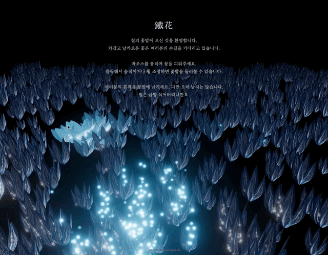

# Iron Flower (鐵花) — 마우스로 피어나는 철의 꽃밭



## 개요

**Iron Flower**는 Three.js 기반의 인터랙티브 3D 아트워크다. 검은 배경 위에 1,200송이의 꽃이 심어진 들판이 펼쳐져 있고, 마우스(또는 터치)가 다가간 위치의 꽃들만 반경 안에서 서서히 피어난다. 완전히 만개한 꽃은 시안색으로 발광하며 위로 파티클을 흩뿌리고, 커서가 멀어지면 다시 서서히 오므라든다.

- **컨셉**: 차갑고 날카로운 철의 꽃이 손길에 반응해 피었다가, 손이 떠나면 금방 식어버린다.
- **인터랙션**: 마우스 이동 → 근처 꽃 개화 / 발광 / 파티클 분출. 클릭 드래그·휠로 카메라(OrbitControls) 회전 및 줌.
- **에셋**: Blender에서 Shape Key(모프 타겟)로 꽃잎의 개화 애니메이션을 만들어 `leaf.glb`로 export.

## 사용자 흐름

1. 타이틀 오버레이(`IRON FLOWER / 鐵花`)가 캔버스를 블러 처리한 채 뜬다.
2. 클릭 / 스페이스바 / 터치로 오버레이를 닫으면 블러가 풀리고 상단 가이드 문구가 페이드인.
3. 마우스를 움직이면 `RADIUS` 안의 꽃들이 거리에 비례해 개화하고, 화면 밖으로 나가면 모든 꽃이 서서히 닫힌다.
4. 개화도가 임계치를 넘은 꽃은 emissive 발광 + bloom 후처리로 빛나고, 확률적으로 위로 솟는 파티클을 만든다.

## 기술 스택

- **Three.js** (import map으로 CDN에서 직접 로드, 빌드 툴 없이 순수 ES 모듈)
- **GLTFLoader** — Blender에서 export한 `leaf.glb` 로드
- **OrbitControls** — 카메라 조작
- **EffectComposer + UnrealBloomPass + OutputPass** — 발광 후처리
- **InstancedMesh** — 꽃잎 대량 렌더링 (1,200 flowers × 6 petals = 7,200 instances)
- **Morph Target (Shape Keys)** — 꽃잎이 오므라들고 펼쳐지는 개화 애니메이션
- **Custom shader patch (`onBeforeCompile`)** — 인스턴스별 emissive 발광
- **THREE.Points + 커스텀 ShaderMaterial** — 개화 시 솟아오르는 파티클

## 핵심 구현

### 1. InstancedMesh + Morph Target으로 7,200장의 꽃잎을 한 번에

꽃 한 송이는 `leaf.glb` 하나를 Y축 기준으로 균등 회전시켜 6장을 원형 배치한 것이다. 1,200송이 전체를 `InstancedMesh` 하나로 그려서 드로우콜을 1회로 유지한다.

```javascript
flowers = new THREE.InstancedMesh(geometry, material, INSTANCE_COUNT); // 1200 × 6
```

개화 애니메이션은 별도 스켈레톤 없이 Blender Shape Key(모프 타겟)로 만들어졌고, 매 프레임 `InstancedMesh.setMorphAt(index, carrier)`로 인스턴스별 모프 가중치(0=오므림 ~ 1=만개)를 밀어 넣는다. `setMorphAt`은 `object.morphTargetInfluences` 프로퍼티만 읽기 때문에, 실제 Mesh가 아닌 `{ morphTargetInfluences }` 형태의 가벼운 캐리어 객체 하나로 충분하다.

### 2. 마우스 → 지면 좌표 → 개화도

마우스 스크린 좌표를 Raycaster로 y=0 평면에 투영해 월드 좌표(`mouseWorld`)를 구하고, 각 꽃과의 거리(`dist`)로 목표 개화도를 계산한다.

```javascript
const t = clamp(1 - dist / RADIUS, 0, 1);
const target = t * t * (3 - 2 * t);           // smoothstep — 경계를 부드럽게
openAmount[i] = damp(openAmount[i], target, DAMPING, dt); // 프레임독립 지수보간
```

`smoothstep`으로 반경 경계에서 뚝 끊기지 않게 하고, `MathUtils.damp`로 프레임레이트에 무관하게 부드럽게 열리고 닫히도록 했다.

### 3. 인스턴스별 발광 — emissive는 uniform이라는 함정

`MeshStandardMaterial`의 `emissive`는 셰이더에서 **uniform**, 즉 모든 인스턴스가 값을 공유한다. 인스턴스마다 다른 밝기로 빛나게 하려면 머티리얼 자체를 새로 만들 수 없으니, `onBeforeCompile`로 셰이더 소스에 인스턴스 attribute(`aGlow`)를 끼워 넣어 `emissivemap_fragment` 직후에 발광을 더하는 방식을 택했다.

```c
float glow = pow(clamp(vGlow, 0.0, 1.0), uGlowGamma);
totalEmissiveRadiance += uGlowColor * uGlowStrength * glow;
```

이렇게 하면 Blender에서 만든 baseColor/normalMap 등 원본 룩은 그대로 유지한 채 개화도에 따른 발광만 추가할 수 있다. 단, `onBeforeCompile`을 바꾼 머티리얼은 `customProgramCacheKey`도 함께 바꿔줘야 이전(패치 전) 셰이더 프로그램이 캐시에서 재사용되는 문제를 피할 수 있다.

### 4. Bloom 임계값 역산

`UnrealBloomPass`는 특정 밝기(threshold) 이상만 번지게 하는데, 이 값을 감으로 잡으면 조명 받은 표면까지 새어 번지거나 반대로 꽃이 전혀 빛나지 않는다. 현재 `GLOW_COLOR`(시안) × `GLOW_STRENGTH`(2.0) 조합에서 만개 시 최대 luminance를 역산(약 1.07)해 `BLOOM_THRESHOLD`를 그보다 낮게 고정했다 — 파라미터 하나를 바꾸면 이 계산도 같이 맞춰야 한다.

### 5. 파티클 — 고정 크기 링버퍼

개화도가 임계치를 넘은 꽃에서 확률적으로(`PARTICLE_SPAWN_RATE * dt`) 파티클을 생성한다. `PARTICLE_MAX`(500)개짜리 배열을 링버퍼로 순환시켜, GC 없이 오래된 슬롯을 덮어쓰는 방식으로 개수를 무한정 늘리지 않고 관리한다. 파티클은 `THREE.Points` + 커스텀 셰이더로, 화면상 크기가 원근에 따라 일정하게 보이도록 `gl_PointSize`를 카메라 거리로 보정했다.

## 파일 구조

```
Artwork_260815_iron_flower/
├── index.html          # 타이틀/가이드 오버레이 마크업, import map
├── style.css           # 오버레이 UI, 블러 트랜지션
├── main.js             # Scene 구성 · 인터랙션 · 셰이더 패치 · 애니메이션 루프
└── assets/
    ├── MODELING.blend       # 원본 Blender 파일 (Shape Key 포함)
    └── leaf.glb             # export된 꽃잎 메쉬 + 모프 타겟
```

## 배운 점 / 트러블슈팅 메모

- **InstancedMesh + Morph Target 조합**은 개별 스켈레톤 애니메이션 없이도 수천 장의 유기적인 변형(개화)을 저비용으로 표현할 수 있는 좋은 조합이었다.
- **인스턴스별 emissive**처럼 머티리얼 uniform이 인스턴스 단위로 달라야 하는 경우, `onBeforeCompile` + 커스텀 attribute + `customProgramCacheKey` 조합이 정석 해법이다.
- **Bloom threshold는 감이 아니라 계산**으로 잡아야 한다 — 발광 색상/세기 조합의 실제 luminance를 먼저 구하고 그보다 낮게 설정해야 의도한 부분만 정확히 번진다.
